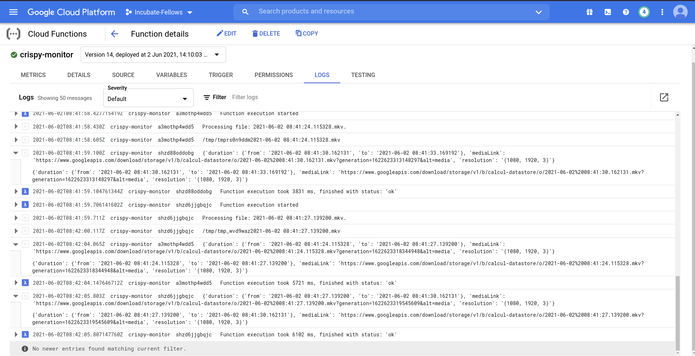

# :zap: crispy-streamer :tv:

### Brief

<hr>

#### Source code (and explanations) for implementing the objective of uploading frames into `GCS bucket`, compute its resolution, and log the details. <br><br>I have used `docker` with custom `Dockerfile` for provisioning a fine tuned runtime for running the concurrent frame upload worker nodes, worker nodes are managed by `celery`. <br><br> Tested with sample CCTV footages (From Youtube), consistently achieved `60+ FPS` :rocket: with still a huge room for optimisation here, for instance `scene-based` resolution resizing and video compression on top of that, could significantly improve the performance beyond 100+ FPS.<br><br>

### Working of frame uploader

<hr>

####  <br>

:paperclip: `main.py`, edit this snippet in codebase, [here](https://github.com/vhaegar1526/crispy-streamer/blob/47af99e21f4b07c281a8244dfc5d2e95d224227e/gcs-celery-worker-src/src/main.py) :)

```python
# Set window size, for video chunk.
WINDOW_SIZE = 3.0

# For every X input frame, 1 frame is written to uploader.
# REFRESH_RATE represents X.
# For instance, Setting to 3, will mean, Upload every 3rd frame ...
REFRESH_RATE = 3
```

#### Uploading small video chunks, rather than individual frames because ...

- Uploading individual frames is very expensive for bandwidth, and too much dependent on network.
- For instance, uploading 50-60 FPS with individual frame upload means, 50-60 asynchronous HTTP requests every second, and a bad network would imply, all 50-60 requests to be processed v slowly, and delaying the task queue consequently.
- Uploading video in small video chunks (whose size can be tweaked with precision of miliseconds) solves the problem.
- `Maximum of 5-8 concurrent HTTP requests`, and it's more efficient, as single chunk of 3 seconds is a collection of 180 (or 90) Frames / Depending upon the FPS of source.
- `Best part -> Reduces operational overhead in cloud side, we won't have to run queing jobs to align the frames into the correct sequence, as these are time-stamp annotated video chunks, having the frames in sequence.`
- I have designed the code in a way, that it signs the metadata to every video chunk before uploading, with the exact duration of video-clip it contains, `Dataflow` can read this `Metadata` and streamline the data efficeintly for cognitive processing in later stages.

### Microservice architecture for uploader, with celery task queue

<hr>

#### I have used 4 micro-services (managed by docker-compose) for isolating the all the independent services required, describing here ...

| Micro-service     | Provided Service                                                                                                     |
| ----------------- | -------------------------------------------------------------------------------------------------------------------- |
| redis             | Serves as backend for celery                                                                                         |
| rabbitmq          | Serves as message borker for celery                                                                                  |
| gcs-celery-worker | Provisions worker nodes for concurrent uploads                                                                       |
| stream-handle     | Accepts RTSP/Video stream, implements windowing for breaking into chunks, calls celery-app asynchronously once done. |

#### Explanation and file structure, how I made sure `gcs-celery-worker` and `stream-handle` work on the same filespace (As required by celery to be callable).


##### I have implemented docker-named-mounts, where in the containers can write video chunks, and can be efficently shared by worker-nodes to be used, without needing to transfer the file bw containers.<br><br>

### Cloud Architecture to process the frames, once received

<hr>


- Video chunks are written to `GCS bucket`
- `GCS events` configured for `publishing` the `FINALIZE-OBJECT` event upon received video chunk.
- `pub-sub` triggers the `google-cloud-function` as a subscriber, and processes the data by streaming the video file, and logs the
  1. `Video Resolution` (Length, breadth and color-channels)
  2. `Duration` (Exact duration for which the video chunk has the clip, read from `METADATA` as signed by the local-uploader, during creation.)
  3. `mediaLink` for accessing the video-chunk, this is crucial, as all further processes within Google-Cloud can use this URL securely to run `inferences` and is already annotated with the exact `time-stamp`.

#### Some snapshots of the generated logs ...



#### Zooming in ... :mag:


<hr>

### Hardware configuration </>

Workload of the on-premise device can be primarily categorized into >

| Task             | Desc                                                                                       | Type                     |
| ---------------- | ------------------------------------------------------------------------------------------ | ------------------------ |
| Ingestion        | Ingesting/Reading from various IP streams                                                  | IO-Bound                 |
| Client-Analytics | Analysing streams in real-time to determine encoding quality, or generate real-time alerts | Computaionally Intensive |
| Uploading        | Upload video streams into cloud (for archiving and advanced inferences with AI in cloud)   | IO-Bound                 |

- `Ingestion` and `uploading` being IO-Bound tasks, can work without having to depend on GPU runtime, and substantially improved performance via multi-threading, monitored by celery.
- `Client-analytics` (CPU env), It is possible to run a mobile-optimised machine learning framework like tensorflow-lite or mediapipe on a CPU, but it will get bottlenecked in executing multiple IP streams, reason being

  - Each client-analytic (ML model) instance is a neural-network and _will rely on intensive computations for each cylce_.
  - Hence it's _not an IO-bound task_, i.e putting it into _concurrent execution with celery (in a CPU env) will probably degrade the overall performance_, although implementing multi-processing here might make a minimal difference.
  - I think, it's safe to say `client-analytics on CPU should not be extended beyond 4 IP streams`, for real-time analysis.

- `Client-Analytics` (GPU env), is the best way to power a Machine Learning Model, reason being it's hardware architecture,
  - A CPU generally has 2/4/8/12/16 or upto 128 (4000$ /-) cores, where as a beginner-level GPU has 4500+ cores, not clocked at a frequency as high as CPU cores, but the physical count of cores is 500x that of a general CPU. Due to this hardware limitation, GPU completely crushes down a CPU in model execution.
  - At its core, a neural network is a series of Matrix Multiplication of weights accross the layers in every cycle, and here's a graph showing the advantage of parallel computation provided by GPU
    
  - On top of that lots of framework provide even better optimisation to make best use of these multitude of cores, the ones I'm aware of are Nvidia-CUDA, Nvidia-RT and Tensorflow-GPU.

### Best Workaround w/o GPU

- `Client-Analytics` for multiple IP-streams on the on-premise device, considering the endless chip shortage right now, the best workaround would be TPU (Tensor Processig Unit). Its expensive, but it's mobile versions exist, and provide `better performance/cost ratio` compared to GPU, I researched about it, currently it's not in practice by any video-monitoring cctv service, deploying this in practice can be a novelty too.

  - _Google's developed coral-stick (at just 60$) is a custom designed FPGA capable of 4 Trillion-Operations-Per-Second (TOPS)._
  - Benchmarks shows, it can run MobileNet at more than 400FPS with object detection.
  - Complete documentation of google coral, [here.](https://coral.ai/products/accelerator/)

- Advantages

  - Plug-and-play USB stick.
  - Frees the CPU from ML workload, and won't let the concurrent threads uploading video to cloud be bottlenecked due to extensive workload.
  - 4-TOPS computational speed, without any dependency on the machine, works with any PC configuration.
  - Multiple corals plugged into system, provide very effective horizontal scaling.

- Limitation

  - Out of the box, it supports tensorflow-lite based models, for direct porting.
  - Models running on different frameworks, might require extra work to be executable on coral stick.

#### My suggested architecture for 10-IP camera setup.

##### I haven't worked on these workstations first hand, but I went through various article, user experiences, and module's documentation, on paper this configuration seems optimal for 10 IP-stream setup.

| Component | Spec                                                                                                              |
| --------- | ----------------------------------------------------------------------------------------------------------------- |
| CPU       | AMD Ryzen 7 3700X (8-cores, substantial boost for ingestion and uploading.)                                       |
| RAM       | >= 16 GB (Virtualisation with Docker, and multiple worker nodes executing in parallel will benefit from more RAM) |
| GPU       | NVIDIA T1000 (Power efficient and 896 CUDA cores, can run multiple neural nets, for powering client analytics)    |

<hr>

#### Case-Study of Camio box configurations

| IP streams supported <= 2 | Config               |
| ------------------------- | -------------------- |
| CPU                       | ARM based mobile CPU |
| RAM                       | 2 GB                 |
| GPU                       | None                 |

| IP streams supported <= 14 | Config                                                                                                                       |
| -------------------------- | ---------------------------------------------------------------------------------------------------------------------------- |
| CPU                        | i5, 6-cores                                                                                                                  |
| RAM                        | 16 GB                                                                                                                        |
| GPU                        | NVIDIA Quadro P1000 / 640 CUDA enabled cores/ DataCenter variant GPU tweaked at lower clockrates compared to gaming variants |

| IP streams supported <= 42 | Config                                                      |
| -------------------------- | ----------------------------------------------------------- |
| CPU                        | Intel Xeon Silver 4214 2.2G, 12-Cores                       |
| RAM                        | 32 GB                                                       |
| GPU                        | NVIDIA Quadro RTX 4000 / 2304 CUDA cores + 288 Tensor Cores |

| IP streams supported <= 140 | Config                                                                        |
| --------------------------- | ----------------------------------------------------------------------------- |
| CPU                         | 2x Intel Xeon Gold 5220R 2.2G, 24 physical cores                              |
| RAM                         | 96 GB                                                                         |
| GPU                         | 2x NVIDIA Tesla T4 / 5120 CUDA cores + 640 Tensor core (Combinging both GPUs) |

1. #### Looking at camio's box architecture, seems most of the Machine Learning inferences are being done on-premise, as the box is equipped with Quadro RTX GPU , it must be capable of running multiple instances of Neural Nets without any bottlenecking.

2. #### Cloud architecture of camio depends on the box for providing inferences, compressed video chunks, and dataflow checks through the inferences and to manage usage-based billing and filtering the data in general.

3. #### The cloud architecture, also provides ML for NLP, to understand the queries, and search them down from datastore, which is indexed on basis of events, timestamps, camera-source to enable near real-time querying.

4. #### Another important functionality of Cloud platform is to enable customised ML, for searching and keeping track of particular events on user's demand, for instance a black-dog/red car/any object in the camera with ID XXXXX, probably their app engine runs thorough the inferences given by Box, to filter out these events.

5. #### Another key advantage of running ML on-premise for camio, they ML is learning from the user's behaviour, whereas in cloud, the deploying the same functionality on cloud AI might be challenging as separate DBs need to be mantained to keep track of user preferences.

  <hr><br>

### Limitations

- Atleast 8 gigs of RAM is required for running all the micro-services in parallel , under my testings it peaked out at little more than 7GB, and will linearly increase to stream from different sources simultaneously.

### Risks

- Service account credentials (as JSON) is present within docker image, in production I would be passing it as environment vairable, but for quicker dev and testing, I have made it available within docker itself _[FIXED NOW, using docker-bind-mount and exposing via environment variable]_.
- Uploader works with the semantic of `try once` I have not configured it for retrying upload in case the current upload fails, with some tweaks it can be set to retry upon failure, it's doable.

### Scalabilty

- SCALABILTY is unbounded, I have built the source code, with one goal of making it serverless as much as possible, on premise, the docker-compose setup does not depend on and HOST or IO transaction for communicating or sharing files, rather I have used docker managed volumes, which makes it capable to spin-up and down or scale horizontally as and when required.

<hr>

### Coming to what could be done better?

- Integration of `Cloud Dataflow` could automate the process of ingesting data-streaming, monitoring and modelling, but as it has a peeky learning curve, I couldn't integrate it under the given time constraints, but I would be happy to learn and integrate it in future.

- `stream-handle` writes the video as raw byte strings, with .mkv container, which makes the file to be uploaded of size larger than it should be, I plan to use video compressions, to reduce this significantly, and it can boost the upload processing speeds (currently ~ 60+ FPS) to more than 100 FPS, for sure.

- `docker-compose` is what I have used here, to provision and isolate seprate containers for the different micro-services to run in, as good as it is, using Kubernetes would have been better, as it has
  - Healing attributes for container
  - Retries automatically if container fails or provisions a new one instantly, and
  - Can be managed and monitored by cloud dashboards.

<hr>

### Testing the system.

To test the system, there a few pre-requisites to be satisfied,

- Docker and docker-compose installed in the system. (podman and podman-compose will work fine too, tested already.)
- Google service account credentials, with sufficient permissions to write, and create buckets (If not already created). [In production, I would make sure credentials are passed as environment variable, rather than manual upload]

#### _Steps for testing_

> Rename the service account credential as `creds.json` and place it in, `gcs-celery-worker-src`/

> Rename the video file to be uploaded as `cctv.mp4` and do place it in, `stream-handle-src`/`src`/

> Just open the root directory of the project, and run `sudo docker-compose up`

_NOTE_ : In practice it will be a RTSP stream, that can be accessed in real-time, or I would setup a docker bind-mount to provide the video file in real-time, for now I have hardcoded it to `cctv.mp4`.

<hr>

Apart from all the limitations and risks I have stated, there might be some more, that I'm not aware of, do let me know about those, I'll be happy to rectify those.
